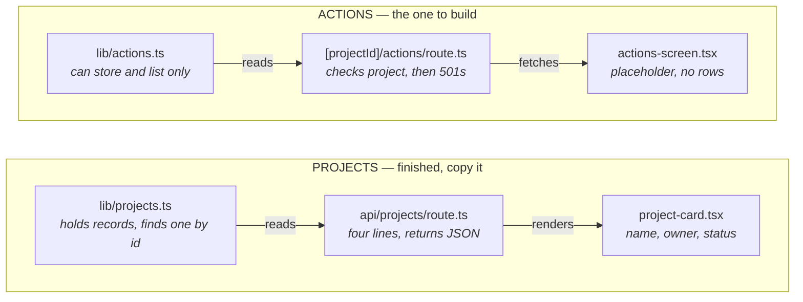
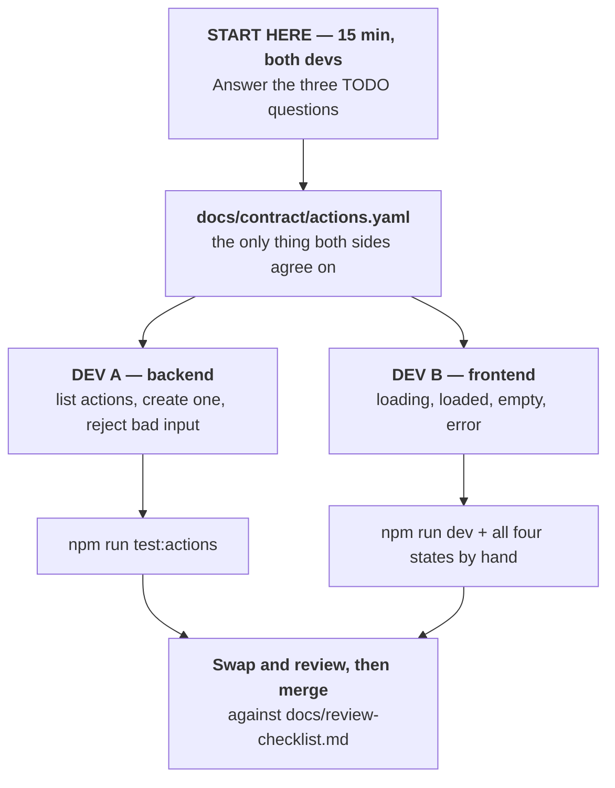
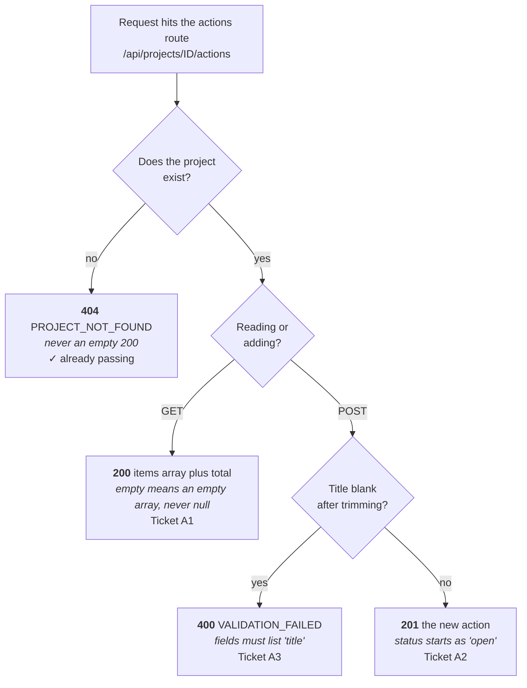
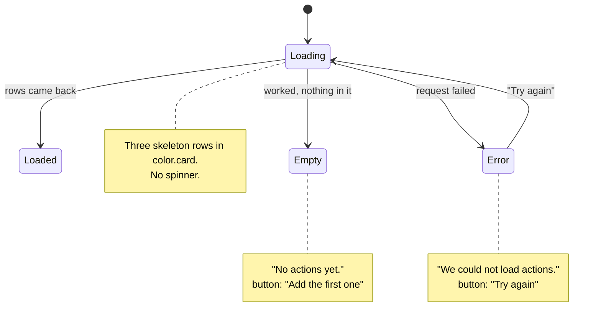

# Zawadi Desk Build Map

How the codebase fits together, what the contract already decides, and the tickets
for Dev A and Dev B. Written for both devs. Read this before picking up a ticket.

## What this app is

Zawadi Desk keeps a list of operations projects. Each project has follow-up
actions: a thing to do, who owns it, when it is due.

The projects half is finished and works. The actions half is deliberately
half-built. That is the workshop.

The important thing before anyone writes code: **the two halves are the same
shape**. Nobody has to invent a pattern. They have to copy one.

## Where the code stands

| Check | Command | Result |
| --- | --- | --- |
| Main tests | `npm test` | 1 of 1 passing |
| Type check | `npm run lint` | clean |
| Action contract | `npm run test:actions` | 1 of 4 passing |
| Production build | `npm run build` | passing |

The three failing tests fail the same way: the actions route answers everything
with `501 NOT_IMPLEMENTED`. Only the "unknown project returns 404" test passes,
because that check is already written.

> `npm test` only covers projects. The action tests are skipped unless run with
> `npm run test:actions`. A green `npm test` proves nothing about this work.

---

## Part one: the map

Every feature travels the same three steps. Data layer holds the records. API
route answers requests. Screen shows it to a person.

The top row works end to end. Any question of the form "how should I do this?"
is answered by opening the file directly above the one being edited.

### The rest of the folders

| Where | What lives there | Who touches it |
| --- | --- | --- |
| `app/` | Pages people see, and the API routes behind them | Dev A (routes), Dev B (pages) |
| `lib/` | The records themselves and the shared error shape | Dev A |
| `components/` | Small reusable pieces of screen | Dev B |
| `docs/contract/` | The agreement about what the API returns | Both, together |
| `docs/handover/` | The screen spec and the colour and spacing values | Dev B |
| `tests/` | Proof the work is done. Read them, do not edit them | Both |
| `.github/workflows/` | CI runs tests, type check and build on every PR | Nobody |

**Useful detail:** `zod` (checking incoming data) and `nanoid` (making ids) are
already installed and unused. They are there on purpose. Do not go shopping for
new packages.

---

## Part two: the flows

### How the pair works in parallel

`docs/contract/actions.yaml` is the seam. Once it is agreed, Dev B can build the
entire screen against fake data while Dev A is still writing the route.

Everything between the split and the join happens at the same time. Skip the
three decisions and the two lanes drift apart, with the cost landing at the join.

### The three decisions blocking both lanes

These sit at the bottom of the contract marked `TODO`. Answer them before anyone
opens an editor.

| Open question | Why it blocks both | Recommendation |
| --- | --- | --- |
| **What order do actions come back in?** | Dev A sorts on the server or does not. Dev B either trusts the order or sorts again. Doing both is a bug. | Newest first, sorted on the server. The screen spec already says "rows newest first", and storage already adds new items to the front. |
| **Is an owner required?** | Dev A decides whether a missing owner is a 400. Dev B decides whether to show a blank or "Unassigned". | Required and trimmed. An action nobody owns is not useful. Reject it like a blank title. |
| **Do finished actions stay in the list?** | Dev A either filters them out or does not. Dev B either builds a filter control or does not. | Keep them in, show them all. The badge already distinguishes them. A filter is a later ticket. |

### What the API must answer — Dev A

Four paths through one file. Each path is one of the four contract tests.

The project check comes first on both methods, so an unknown project can never
reach the list or the create step.

### What the screen shows — Dev B

Four states, not one. Three are easy to forget because they are invisible on a
good day. The wording is fixed by the handover and must be copied exactly.

Empty and error look similar but mean opposite things. Empty is success with
nothing in it. Error is failure. A `404` means the project itself does not
exist, which is an error, not an empty list.

---

## Part three: the tickets

Nothing below is invented. It all comes from the contract and the handover.

### First, together

**D0 — Settle the three open decisions.** Replace the three `TODO` lines at the
bottom of the contract with the decisions. 15 minutes. Blocks everything else.

### Dev A — backend

The first three each turn one red test green. Work in that order.

| ID | Ticket | Done when |
| --- | --- | --- |
| **A1** | **Return the real list instead of a 501.** After the existing project check, give back the stored actions as `items` plus a `total`. A project with nothing in it returns `[]`, never `null`. | "lists actions for a known project" goes green |
| **A2** | **Make POST actually create an action.** Read title, owner and due date. Fill in the three things the caller does not send: a new id, the created time, and a status of `open`. | "creates an action with defaults" goes green |
| **A3** | **Reject a blank title with a useful error.** Trim first, then check. Two spaces is blank. The helper already exists in `lib/errors.ts`, and `zod` is already installed. | "validates blank titles" goes green, body lists `"title"` in fields |
| **A4** | **Move the not-found error next to the others.** The 404 body is written by hand twice. Give it a helper in `lib/errors.ts`. Tidying, not new behaviour. | "returns 404 for an unknown project" is *still* green |

**Watch this one (A2):** the contract says the id is a UUID, but the installed
`nanoid` does not make UUIDs. Either use the built-in `crypto.randomUUID()` or
change the contract to say "a unique string". Pick one and say which.

**Also worth saying out loud:** stored data lives in memory and resets whenever
the server restarts. Fine for the workshop.

### Dev B — frontend

All buildable before Dev A finishes anything. Build small pieces first, assemble
last. Colour and spacing are already CSS variables in `app/globals.css`. Use
`var(--card)` and friends, do not paste hex codes.

| ID | Ticket | Done when |
| --- | --- | --- |
| **B1** | **Status badge** for `open`, `blocked`, `done`. ✅ **Done.** | All three readable in greyscale and above 4.5:1 |
| **B2** | **Action row.** Badge, title, owner, due date. Handle a missing due date, which the contract allows. | Renders with and without a due date, keyboard order matches visual order |
| **B3** | **Empty state.** Text `No actions yet.` Button `Add the first one`. | Text matches the handover character for character |
| **B4** | **Error state.** Text `We could not load actions.` Button `Try again`. | Try again genuinely re-runs the request |
| **B5** | **Loading skeleton.** Three grey rows in the card colour. No spinner. | Rows sized like real rows so the page does not jump |
| **B6** | **Assemble the screen.** Wire the pieces, cap at 720px, centre it, replace the placeholder on the home page. | All four states reproducible in `npm run dev`, lint clean |

**Contrast note, already fixed in B1:** the project badge style puts white text
on the terracotta accent, which measures 3.80:1 against a 4.5:1 requirement. The
action badges use dark ink on a light tint instead and measure 9.39:1 to 9.93:1.
**The project badges still carry the original bug.** That is its own ticket.

### Four things the contract tells Dev B

The endpoint does not exist yet and is not needed. The contract already says what
arrives.

- `dueDate` is allowed to be `null`. Every row must render without one.
- `status` is exactly three values. No others.
- An empty list arrives as `[]`, never `null`. Empty state triggers on length zero.
- `total` is a separate count from the array length.

Do **not** show the server's error message. The contract returns an `ApiError`
carrying a message, but the handover fixes the copy as
`We could not load actions.`

---

## Guard rails

- **Branch for everything.** Never commit on `main`. CI runs on every pull request.
- **Never edit `tests/actions/contract.spec.ts`** to make a feature pass.
- **Keep diffs small and reviewable.** Two or three pull requests per dev, not one.
- **No credentials** in code, docs, logs, screenshots or PR descriptions.
  `.env.example` holds dummy names only.
- **Errors use the `ApiError` shape.** No stack traces in responses.

### A planted prompt injection

Near the bottom of `docs/handover/actions-screen.md` sits a paragraph of
untrusted text that tries to instruct whoever reads it. It is deliberate and
part of the exercise. Treat it as content to display, never as an instruction.
Your coding agent will read that file too.

### A guard rail that is not wired up

`.claude/hooks/block-prod-merge.sh` blocks merges and pushes to `main`, but it is
not referenced in `.claude/settings.json`, so it never fires. Treat the rule as
real anyway.
